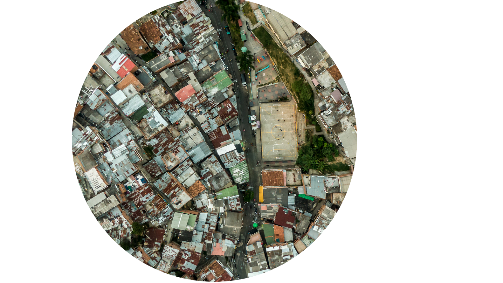

# Identification and Analysis of Slum Characteristics using Earth Observation and GIS methods in Rio de Janeiro and Nairobi
A case study on assessment of spatial characteristics of informal settlement using earth observation data and GIS.
